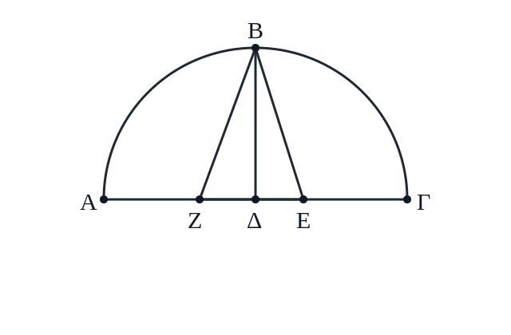
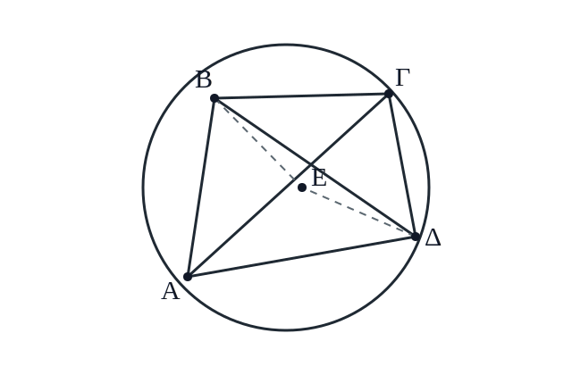
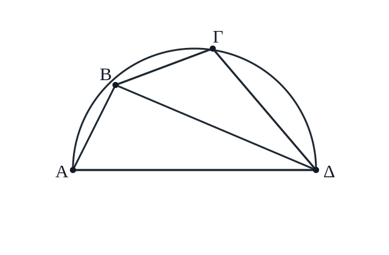
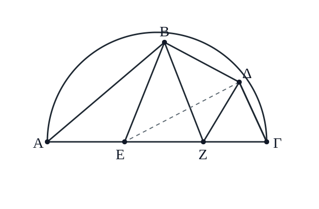
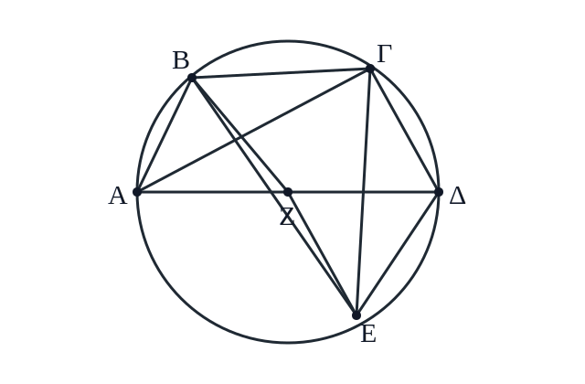
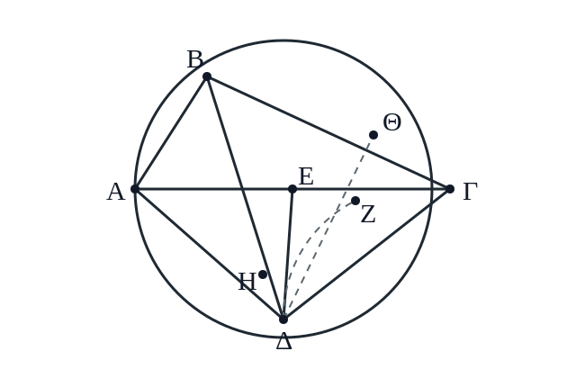
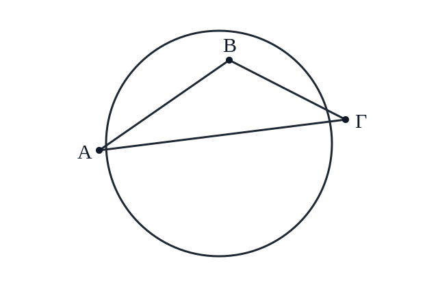

# Book I.10 圆内弦长之论

translation_status: `CONTROLLED_DRAFT_TRANSLATION__REVIEW_PENDING`
source_file: `../src/010_book_i_10_chords.md`
scope: `Book I.10 controlled draft`
figure_assets: `../../assets/figures/drafts/`

## 章节控制说明

本章译文依据 `chapters/src/010_book_i_10_chords.md` 的古希腊文底稿。英译本只可作为 reference witness，不作为转译底稿。图中点名保留希腊大写字母。读者版正文把原文中“某弧所对的直线”按现代习惯译为“弦”，并在章末注说明。数值仍按 `qa/technical/numeric_validation_log.md` 校验，但正文使用现代可读的六十进制显示法。本章末尾只引出弦表的编排方法；弦表本体从 Book I.11 开始，不属于本章范围。

## 正文

为便于随时查用，下面要列出一张弦表：把圆周分成 `360°`，每隔半度列出相应弧的弦长，并说明在直径取 `120` 份时，这些弦各有多长。直径这样取值，是因为后面的计算会显示它很便于使用。〔1〕

不过，在列出弦表以前，需要先说明计算方法：怎样用尽量少、且可以反复使用的一组定理，快速求出这些弦长。这样一来，表中的数值就不是凭空列出，而是可以从几何构造中逐步检查。以下数值均按六十进制处理；乘除时也采用近似值，只要误差小到感觉上不可辨即可。〔2〕

### 十边形边与五边形边

先设半圆 `ΑΒΓ`，其直径为 `ΑΔΓ`，圆心为 `Δ`。从 `Δ` 向 `ΑΓ` 作垂线 `ΔΒ`。又把 `ΔΓ` 在 `Ε` 处平分，连结 `ΕΒ`；令 `ΕΖ` 等于 `ΕΒ`，再连结 `ΖΒ`。我说：`ΖΔ` 是十边形的边，`ΒΖ` 是五边形的边。

因为直线 `ΔΓ` 在 `Ε` 处被平分，又有直线 `ΔΖ` 附加在它上面，所以由 `ΓΖ` 与 `ΖΔ` 所成的矩形，加上以 `ΕΔ` 为边的正方形，等于以 `ΕΖ` 为边的正方形（依据《几何原本》II.6〔4〕），也就是等于以 `ΒΕ` 为边的正方形，因为 `ΕΒ` 等于 `ΖΕ`。而以 `ΕΒ` 为边的正方形，又等于以 `ΕΔ` 与 `ΔΒ` 为边的两个正方形之和（依据《几何原本》I.47〔5〕）。所以，由 `ΓΖ` 与 `ΖΔ` 所成的矩形，加上以 `ΔΕ` 为边的正方形，等于以 `ΕΔ` 与 `ΔΒ` 为边的两个正方形之和。减去共同的以 `ΕΔ` 为边的正方形，余下由 `ΓΖ` 与 `ΖΔ` 所成的矩形，等于以 `ΔΒ` 为边的正方形，也就是等于以 `ΔΓ` 为边的正方形。于是 `ΖΓ` 在 `Δ` 处分成外中比（依据《几何原本》VI 定义 3〔6〕）。

既然同一圆内所作六边形的边和十边形的边，在同一直线上按外中比分割（依据《几何原本》XIII.9〔7〕），而 `ΓΔ` 是从圆心所出之线，包含六边形的边（依据《几何原本》IV.15 系〔8〕），所以 `ΔΖ` 等于十边形的边。同样，既然同一圆内所作五边形的边，其平方等于六边形边与十边形边的平方之和（依据《几何原本》XIII.10〔9〕），而在直角三角形 `ΒΔΖ` 中，以 `ΒΖ` 为边的正方形等于以 `ΒΔ` 为边的正方形与以 `ΔΖ` 为边的正方形之和（依据《几何原本》I.47〔5〕），其中 `ΒΔ` 是六边形边，`ΔΖ` 是十边形边，所以 `ΒΖ` 等于五边形的边。

现在取圆的直径为 `120` 份。这样，`ΔΕ` 是半径的一半，长 `30` 份，平方为 `900`；`ΒΔ` 是半径，长 `60` 份，平方为 `3600`。所以，以 `ΕΒ` 为边的正方形，也就是以 `ΕΖ` 为边的正方形，面积合计为 `4500`。由此得到 `ΕΖ` 约为 `67p04′55″`，余下的 `ΔΖ` 约为 `37p04′55″`。因此，十边形的边对应的弧，在全圆 `360°` 中为 `36°`；当直径取 `120` 份时，这条边长约 `37p04′55″`。

又因为 `ΔΖ` 约为 `37p04′55″`，它的平方为 `1375p04′15″`；`ΔΒ` 的平方仍为 `3600`。二者相加，得到以 `ΒΖ` 为边的正方形，为 `4975p04′15″`。所以 `ΒΖ` 约为 `70p32′03″`。因此，五边形的边对应的弧为 `72°`；当直径取 `120` 份时，这条边长约 `70p32′03″`。由此也可看出，六边形的边对应的弧为 `60°`，并且这条边等于半径，即 `60` 份。

同样，四边形的边对应 `90°` 的弧，它的平方是半径平方的两倍；三角形的边对应 `120°` 的弧，它的平方是同一半径平方的三倍。半径平方为 `3600`，所以四边形边的平方为 `7200`，三角形边的平方为 `10800`。于是，`90°` 弧的弦长约为 `84p51′10″`，`120°` 弧的弦长约为 `103p55′23″`。

这些基本弦长可先由现成几何关系求得。由此还可看出：一旦知道某一弧的弦长，它补足到半圆的那段弧的弦长也容易求出，因为这两条弦的平方相加，等于直径平方。例如，`36°` 弧的弦已证明约为 `37p04′55″`，平方为 `1375p04′15″`；直径平方为 `14400`，所以补足到半圆的 `144°` 弧，其弦的平方为 `13024p55′45″`，弦长约为 `114p07′37″`。其他情形同理。

下面要说明怎样从这些直线推出其余各个直线；先列一个对本论题非常有用的小引理。

### 圆内四边形的乘积引理

设有一个圆，内接任意四边形 `ΑΒΓΔ`，并连结 `ΑΓ` 与 `ΒΔ`。需要证明：由 `ΑΓ` 与 `ΒΔ` 所成的矩形，等于由 `ΑΒ` 与 `ΔΓ` 所成的矩形，加上由 `ΑΔ` 与 `ΒΓ` 所成的矩形。

令角 `ΑΒΕ` 等于角 `ΔΒΓ`。若再加上共同的角 `ΕΒΔ`，则角 `ΑΒΔ` 也等于角 `ΕΒΓ`。又角 `ΒΔΑ` 等于角 `ΒΓΕ`（依据《几何原本》III.21〔10〕），因为它们所对的是同一弓形。因此三角形 `ΑΒΔ` 与三角形 `ΒΓΕ` 等角。于是成比例：`ΒΓ` 比 `ΓΕ`，如 `ΒΔ` 比 `ΔΑ`（依据《几何原本》VI.4〔11〕）；所以由 `ΒΓ` 与 `ΑΔ` 所成的矩形，等于由 `ΒΔ` 与 `ΓΕ` 所成的矩形（依据《几何原本》VI.16〔12〕）。

再者，因为角 `ΑΒΕ` 等于角 `ΔΒΓ`，又角 `ΒΑΕ` 等于角 `ΒΔΓ`，所以三角形 `ΑΒΕ` 与三角形 `ΒΓΔ` 等角。于是成比例：`ΒΑ` 比 `ΑΕ`，如 `ΒΔ` 比 `ΔΓ`；所以由 `ΒΑ` 与 `ΔΓ` 所成的矩形，等于由 `ΒΔ` 与 `ΑΕ` 所成的矩形。前面又已证明，由 `ΒΓ` 与 `ΑΔ` 所成的矩形等于由 `ΒΔ` 与 `ΓΕ` 所成的矩形；合起来（依据《几何原本》II.1〔13〕），由 `ΑΓ` 与 `ΒΔ` 所成的整个矩形，就等于由 `ΑΒ` 与 `ΔΓ` 所成的矩形，加上由 `ΑΔ` 与 `ΒΓ` 所成的矩形。此即所要证明。

### 已知两弧时，求差弧的弦

有了这个引理以后，设半圆 `ΑΒΓΔ`，直径为 `ΑΔ`。从 `Α` 引出两条直线 `ΑΒ`、`ΑΓ`，并设二者的大小已知，直径同样给定为 `120`。连结 `ΒΓ`。我说：`ΒΓ` 也给定。

因为连结 `ΒΔ`、`ΓΔ`，它们显然也给定，因为它们分别补足前两条直线到半圆。既然 `ΑΒΓΔ` 是圆内四边形，所以由 `ΑΒ` 与 `ΓΔ` 所成的矩形，加上由 `ΑΔ` 与 `ΒΓ` 所成的矩形，等于由 `ΑΓ` 与 `ΒΔ` 所成的矩形。而由 `ΑΓ` 与 `ΒΔ` 所成的矩形给定，由 `ΑΒ` 与 `ΓΔ` 所成的矩形也给定；余下由 `ΑΔ` 与 `ΒΓ` 所成的矩形也给定。又 `ΑΔ` 是直径，所以直线 `ΒΓ` 也给定。

于是可以看出：如果两条弧及其弦长已知，那么两弧之差的弦长也可求得。借这个定理，还可以从已有的差弧推出许多新的弦长，特别是 `12°` 弧的弦，因为我们已经知道 `60°` 弧和 `72°` 弧的弦。

### 已知一条弦时，求半弧的弦

再看另一个问题：已知圆内一条弦，怎样求出它所对应弧的一半所对应的弦。设半圆为 `ΑΒΓ`，直径为 `ΑΓ`，已知弦为 `ΓΒ`。把弧 `ΓΒ` 在 `Δ` 处平分，连结 `ΑΒ`、`ΑΔ`、`ΒΔ`、`ΔΓ`，并从 `Δ` 向 `ΑΓ` 作垂线 `ΔΖ`。我说：`ΖΓ` 等于 `ΑΓ` 与 `ΑΒ` 两条线之差的一半。〔3〕

令 `ΑΕ` 等于 `ΑΒ`，并连结 `ΔΕ`。因为 `ΑΒ` 等于 `ΑΕ`，而 `ΑΔ` 共同，所以两条线 `ΑΒ`、`ΑΔ` 分别等于两条线 `ΑΕ`、`ΑΔ`。又角 `ΒΑΔ` 等于角 `ΕΑΔ`（依据《几何原本》III.27〔14〕）；所以底边 `ΒΔ` 等于底边 `ΔΕ`（依据《几何原本》I.4〔15〕）。而 `ΒΔ` 又等于 `ΔΓ`；所以 `ΔΓ` 也等于 `ΔΕ`。既然三角形 `ΔΕΓ` 是等腰三角形，从顶点向底边所作垂线 `ΔΖ` 使 `ΕΖ` 等于 `ΖΓ`（依据《几何原本》I.26〔16〕）。但整条 `ΕΓ` 是 `ΑΒ` 与 `ΑΓ` 两直线的差；所以 `ΖΓ` 是同二者差的一半。

这样，弦 `ΒΓ` 已知；它补足到半圆的另一条弦 `ΑΒ` 也随之可知。因此，作为 `ΑΓ` 与 `ΑΒ` 之差的一半，`ΖΓ` 也可知。又在直角三角形 `ΑΓΔ` 中，从直角向斜边作垂线 `ΔΖ` 后，三角形 `ΑΔΓ` 与 `ΔΓΖ` 等角（依据《几何原本》VI.8〔17〕）。所以 `ΑΓ : ΓΔ = ΓΔ : ΓΖ`，也就是由 `ΑΓ` 与 `ΓΖ` 所成的矩形，等于以 `ΓΔ` 为边的正方形。既然 `ΑΓ` 和 `ΓΖ` 都已知，`ΓΔ` 的平方也已知，因此 `ΓΔ` 的长度可求得。它正是弧 `ΒΓ` 的半弧所对应的弦。

借这个定理，又能从已知弧不断取半，得到许多其他弦长。特别是从 `12°` 弧的弦出发，可以依次求得 `6°`、`3°`、`1°30′` 和 `0°45′` 弧的弦。计算得到：当直径取 `120` 份时，`1°30′` 弧的弦约为 `1p34′15″`；`0°45′` 弧的弦约为 `0p47′08″`。

### 已知两弧时，求和弧的弦

再设圆为 `ΑΒΓΔ`，直径为 `ΑΔ`，圆心为 `Ζ`。从 `Α` 起依次截取两个已知弧 `ΑΒ`、`ΒΓ`，并连结它们对应的弦 `ΑΒ`、`ΒΓ`；这两条弦也已知。我要说明：连结 `ΑΓ` 后，`ΑΓ` 也可求得。

通过 `Β` 作圆的直径 `ΒΖΕ`，并连结 `ΒΔ`、`ΔΓ`、`ΓΕ`、`ΔΕ`。因为 `ΒΓ` 已知，所以它补足到半圆的弦 `ΓΕ` 也可知；因为 `ΑΒ` 已知，所以 `ΒΔ` 与 `ΔΕ` 也可知。仍用前面的圆内四边形引理：在四边形 `ΒΓΔΕ` 中，对角线 `ΒΔ`、`ΓΕ` 所成的矩形，等于两组对边矩形之和。于是，既然 `ΒΔ × ΓΕ` 和 `ΒΓ × ΔΕ` 都已知，`ΒΕ × ΓΔ` 也已知。又 `ΒΕ` 是直径，所以 `ΓΔ` 可知；它补足到半圆的弦 `ΓΑ` 也随之可知。因此，若两条弧及其弦长已知，两弧合成后的弦长也可求得。

显然，只要把 `1°30′` 弧的弦不断同前面已经求得的弦配合，计算相邻弧的和，就可以登记许多弧长位置。由于弦表按半度排列，剩下的只是每个 `1°30′` 间隔中的两个中间位置。因此，只要能求出半度弧的弦，就可以再用弧的和与差，把其余中间弦长补齐。

不过，如果只知道一条弦，例如 `1°30′` 弧的弦，要用纯几何构造直接求出同一弧三分之一的弦，并不方便；若能做到，我们就能立刻得到半度弧的弦。因此，先从 `1°30′` 弧的弦和 `0°45′` 弧的弦出发，求 `1°` 弧的弦。为此需要一个小引理：它不能在一般情形下精确确定弦长，但用于这样很小的弧时，误差不会达到可察觉的程度。

### 弦与弧之比的小引理

我说：若在圆中作出两条不相等的弦，那么较大弦与较小弦的比，小于它们对应弧的比。

设圆 `ΑΒΓΔ`，其中引出两条不相等的直线，较小者为 `ΑΒ`，较大者为 `ΒΓ`。我说：直线 `ΓΒ` 对直线 `ΒΑ` 的比，小于弧 `ΒΓ` 对弧 `ΒΑ` 的比。因为把角 `ΑΒΓ` 由 `ΒΔ` 平分，并连结 `ΑΕΓ`、`ΑΔ`、`ΓΔ`。既然角 `ΑΒΓ` 由直线 `ΒΕΔ` 平分，则直线 `ΓΔ` 等于 `ΑΔ`（依据《几何原本》III.26、III.29〔18〕），而 `ΓΕ` 大于 `ΕΑ`（依据《几何原本》VI.3〔19〕）。

从 `Δ` 向 `ΑΕΓ` 作垂线 `ΔΖ`。既然 `ΑΔ` 大于 `ΕΔ`，而 `ΕΔ` 又大于 `ΔΖ`，就以 `Δ` 为圆心、`ΔΕ` 为半径作圆，使它交 `ΑΔ` 于 `Η`，并在 `ΔΖ` 的延长线上交于 `Θ`；记此圆为 `ΗΕΘ`。这样，扇形 `ΔΕΘ` 包含三角形 `ΔΕΖ`，所以比它大；而三角形 `ΔΕΑ` 又包含扇形 `ΔΕΗ`，所以也比它大。由此可知，三角形 `ΔΕΖ` 对三角形 `ΔΕΑ` 的比，小于扇形 `ΔΕΘ` 对扇形 `ΔΕΗ` 的比。

而三角形 `ΔΕΖ` 对三角形 `ΔΕΑ` 的比，如直线 `ΕΖ` 对 `ΕΑ`（依据《几何原本》VI.1〔20〕）；扇形 `ΔΕΘ` 对扇形 `ΔΕΗ` 的比，如角 `ΖΔΕ` 对角 `ΕΔΑ`。所以直线 `ΖΕ` 对 `ΕΑ` 的比，小于角 `ΖΔΕ` 对角 `ΕΔΑ` 的比。合比之后，直线 `ΖΑ` 对 `ΕΑ` 的比，小于角 `ΖΔΑ` 对角 `ΑΔΕ` 的比；前项加倍之后，直线 `ΓΑ` 对 `ΑΕ` 的比，小于角 `ΓΔΑ` 对角 `ΕΔΑ` 的比；分比之后，直线 `ΓΕ` 对 `ΕΑ` 的比，小于角 `ΓΔΕ` 对角 `ΕΔΑ` 的比。

但是，直线 `ΓΕ` 对 `ΕΑ`，如直线 `ΓΒ` 对 `ΒΑ`（依据《几何原本》VI.3〔19〕）；而角 `ΓΔΒ` 对角 `ΒΔΑ`，如弧 `ΓΒ` 对弧 `ΒΑ`（依据《几何原本》VI.33〔21〕）。所以直线 `ΓΒ` 对直线 `ΒΑ` 的比，小于弧 `ΓΒ` 对弧 `ΒΑ` 的比。

### 一度与半度弧的弦长近似

有了这个结果，设圆 `ΑΒΓ` 中有两条弦 `ΑΒ` 与 `ΑΓ`。先假定 `ΑΒ` 对应 `0°45′` 的弧，`ΑΓ` 对应 `1°` 的弧。由于弦 `ΑΓ` 与弦 `ΒΑ` 的比，小于弧 `ΑΓ` 与弧 `ΑΒ` 的比，而 `1°` 是 `0°45′` 的三分之四倍，所以弦 `ΓΑ` 小于弦 `ΒΑ` 的三分之四倍。弦 `ΑΒ` 已证明约为 `0p47′08″`，所以弦 `ΓΑ` 小于 `1p02′50″`；这是 `0p47′08″` 的三分之四倍近似值。

再在同一图中，设弦 `ΑΒ` 对应 `1°` 的弧，弦 `ΑΓ` 对应 `1°30′` 的弧。同理，因为 `1°30′` 是 `1°` 的一倍半，所以弦 `ΓΑ` 小于弦 `ΒΑ` 的一倍半。可是我们已经证明，`ΑΓ` 在直径取 `120` 份时约为 `1p34′15″`；因此弦 `ΑΒ` 大于 `1p02′50″`，因为 `1p34′15″` 正是 `1p02′50″` 的一倍半近似值。

这样，`1°` 弧的弦既被证明小于、又被证明大于同一个近似值；因此在直径取 `120` 份时，可把它取为 `1p02′50″`。由前面的结果，还可求得半度弧的弦约为 `0p31′25″`。其余各个间隔也可按前述方法补齐：例如，先把半度弧的弦同 `1°30′` 弧的弦相合，求出 `2°` 弧的弦；再用它同 `3°` 弧的弦作差，求出 `2°30′` 弧的弦。其他位置同理。

### 弦表的引出

我认为，圆内弦长大体可以这样最简便地处理。为了在实际计算时随时查用，我们将在下面列出若干小表。为便于排布，每张小表列 `45` 行：第一栏列出按半度递增的弧，第二栏列出相应弦长，并以直径 `120` 份为准，第三栏列出每半度弦长增量的三十分之一。这样就得到每 `1′` 弧的平均增量；它与精确值的差别小到感觉上不可辨，足以用来计算半度之间的各个位置。

还可以看出，凭借前述同一组定理，若怀疑表中某一条弦数值有书写错误，也能比较容易地检查和校正：可以从它的二倍弧对应的弦入手，也可以从它与其他已知弦的差入手，还可以从补足到半圆的那条弧对应的弦入手。小表的写法如下。

## 本章注释

1. 本章原文常用“某弧所对的直线”来表达现代几何中的“弦”。为便于现代中文阅读，正文多译为“弦”或“某弧对应的弦”；图中点名和证明关系仍按原文保留。
2. `37p04′55″` 这类写法保留原文的六十进制结构，不是十进制小数。这里 `p` 表示整数部/单位部，后面的 `′`、`″` 表示六十进制第一、第二小分；它们不是角分秒。弧和角仍用 `°′″` 表示，例如 `1°30′`。
3. “半弧的弦”指：先把某条弦所对应的弧平分，再求这个半弧对应的新弦。它不是把原来的弦长直接除以二。
4. 《几何原本》II.6：若一条线段被平分，又沿同一直线延长一段，则可把“全线与延长段所成矩形”和“半线平方”的关系转成一个平方关系。本章用它把 `ΓΖ × ΖΔ`、`ΕΔ` 的平方和 `ΕΖ` 的平方联系起来。
5. 《几何原本》I.47：直角三角形中，斜边上的正方形等于两条直角边上的正方形之和，即通常所说的勾股定理。
6. 《几何原本》VI 定义 3：所谓外中比，是指全线比大段，等于大段比小段。本章用它辨认十边形边。
7. 《几何原本》XIII.9：同一圆内，六边形边和十边形边按特定方式放在同一直线上时，会形成外中比分割。
8. 《几何原本》IV.15 系：正六边形内接于圆时，它的边等于圆的半径。
9. 《几何原本》XIII.10：同一圆内，五边形边上的正方形，等于六边形边和十边形边上的两个正方形之和。
10. 《几何原本》III.21：同一圆弓形中的角相等；也就是说，站在同一弓形上的圆周角相等。
11. 《几何原本》VI.4：等角三角形的对应边成比例。本章用它从等角关系推出线段比例。
12. 《几何原本》VI.16：四条线段成比例时，外项所成的矩形等于内项所成的矩形。本章用它把比例式改写成矩形相等。
13. 《几何原本》II.1：一条线段分成若干段时，整段与另一条线所成的矩形，等于各分段分别与那条线所成矩形的和。
14. 《几何原本》III.27：同圆中，相等的弧所对的角相等。
15. 《几何原本》I.4：两个三角形若两边及其夹角分别相等，则底边和其余对应角也相等。
16. 《几何原本》I.26：两个三角形若有两个角和一条对应边相等，则其余边和角也对应相等。
17. 《几何原本》VI.8：直角三角形中，从直角向斜边作垂线后，分出的两个小三角形彼此相似，也与原三角形相似。
18. 《几何原本》III.26、III.29：同圆或等圆中，相等的角对应相等的弧；相等的弧又对应相等的弦。本章用这两步得到 `ΓΔ = ΑΔ`。
19. 《几何原本》VI.3：三角形的角平分线把对边分成两段，这两段与夹角两边成比例。
20. 《几何原本》VI.1：同高的三角形或平行四边形，面积之比等于底边之比。
21. 《几何原本》VI.33：同圆或等圆中，角的比等于它们所对弧的比；本章用它把角的比例转成弧的比例。

> 范围注：原文在此转入 Book I.11 的弦表。Book I.10 到此为止；弦表本体不在本章范围内。
